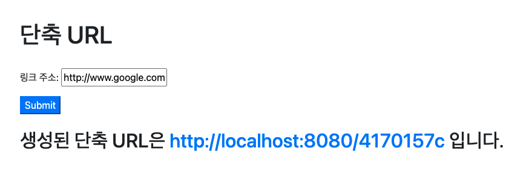

# 단축 URL 생성

## 내용

* URL을 입력받아 짧게 줄여주고, Shortening된 URL을 입력하면 원래 URL로 리다이렉트하는 URL Shortening Service
* 예) https://en.wikipedia.org/wiki/URL_shortening => http://localhost/JZfOQNro



## 실행 방법

* 별도의 설치는 필요하지않으며, 실행 후 http://localhost:8080 으로 접속하여 단축 URL을 생성할 수 있습니다.

## 요구 사항

- 링크
  - [X] URL 입력폼 제공 및 결과 출력
  - [X] URL Shortening Key는 8 Character 이내로 생성되어야 합니다.
  - [X] 동일한 URL에 대한 요청은 동일한 Shortening Key로 응답해야 합니다.
  - [X] 동일한 URL에 대한 요청 수 정보를 가져야 한다(화면 제공 필수 아님)
  - [X] Shortening된 URL을 요청받으면 원래 URL로 리다이렉트 합니다.

* Database 사용은 필수 아님

### 개발 방향

- RDB를 사용할 것인지, REDIS를 쓸 건지부터 고민을 했습니다.   
  단축 URL 정보의 경우, 실제 서비스에서 만료일을 설정해서 일정 기간만 쓰기도 하고   
  영속화하여 오래 보관할 정보는 아니라고 판단을 하였습니다.
- RDB를 사용했을 때 떠올린 전략은 다음과 같습니다. 동일한 요청시 동일한 결과를 리턴하기위해
  1. 원본 링크를 검색.
  2. 조회가 되면 해당 정보 리턴.
  3. 조회가 되지않으면 원본 URL을 저장하고 ID를 리턴.
  4. ID를 인코딩(BASE62같은 인코딩) 사용하여 KEY를 만들고 업데이트
  5. 키로 검색시에는 키값을 디코딩하여 검색
- RDS 사용시, 원본 URL 길이가 데이터마다 일정하지 않고, 원본URL을 서칭하는것은 효율적이지 못하다고 생각했습니다.
- REDIS를 쓴 것은 단축 URL을 빠르게 전달하는 것이 서비스의 가장 첫 목표라고 생각했기떄문입니다.
- 동일한 키 값 보장을 위해 Hash 알고리즘을 고려하였습니다.
- 키 생성은 murmur3 hash function을 사용했습니다. 서칭해본 결과 hash function
  중에 [좋은 성능](https://docs.google.com/spreadsheets/d/1_q2EVcxA2HjcrlVMbaqXwMj31h9M5-Bqj_m8vITOwwk/edit#gid=0)
  , [링크](https://www.sderosiaux.com/articles/2017/08/26/the-murmur3-hash-function--hashtables-bloom-filters-hyperloglog/)   
  을 보이고, 자바 hashmap에서 사용하는 것처럼 실례에서 많이 쓰이는 hash 알고리즘입니다.
- 키 제약사항이 적다면 길이를 더 길게하여 충돌을 줄일 수 있을 것 같습니다.

## REST API

- 단축 URL 생성

1. POST
  - http://localhost:8080/link
2. Request

```json
{
  "link": "http://www.google.com"
}
```

3. Response

```json
{
  "link": "http://localhost:8080/4170157c",
  "count": 0
}
```

- 단축 URL 호출

1. GET

- http://localhost:8080/4170157c

2. REDIRECTION 처리

## 개발 환경

* Spring Boot, Redis, thymeleaf, jQuery
